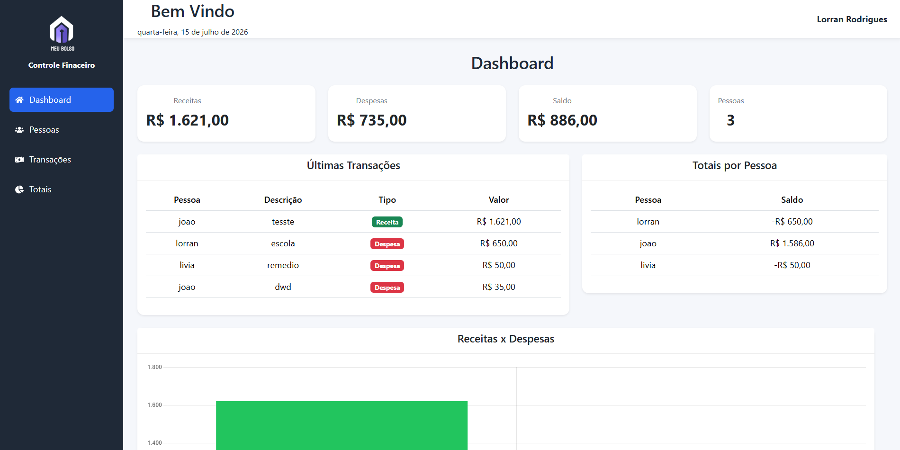
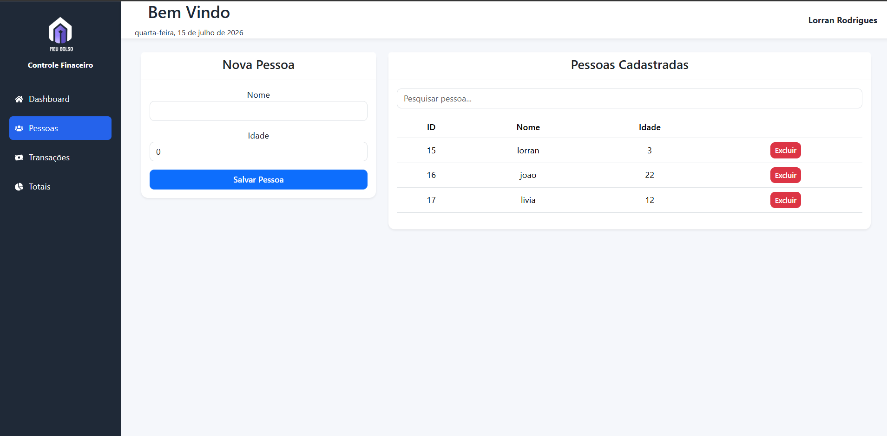
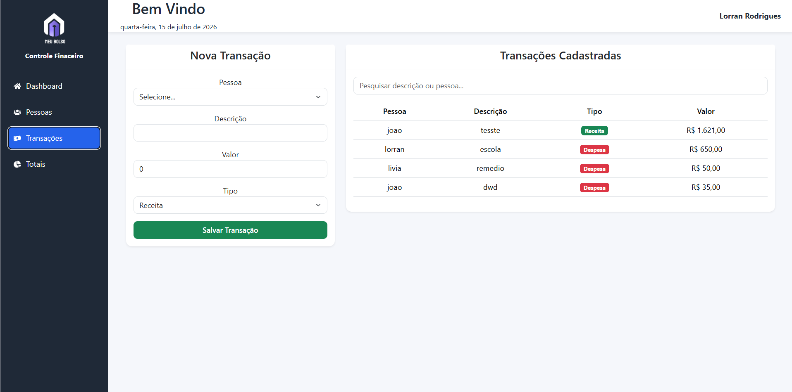
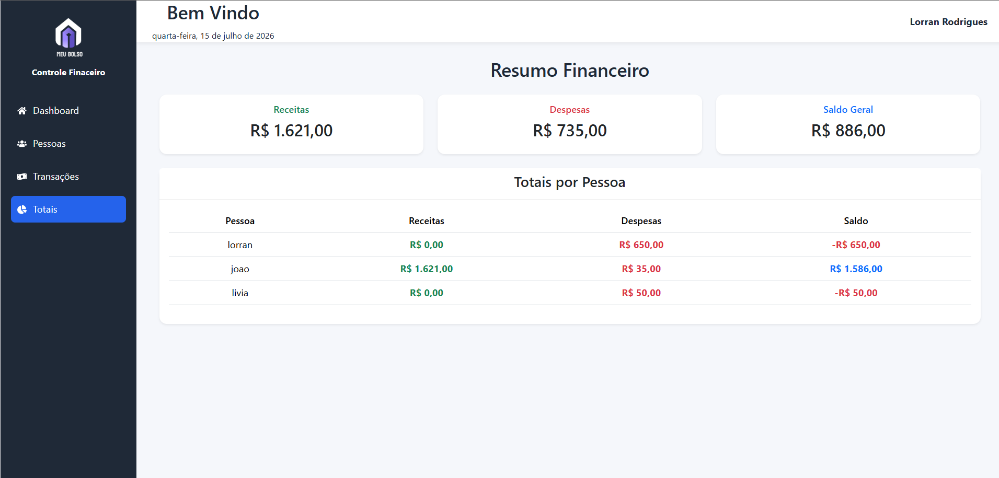
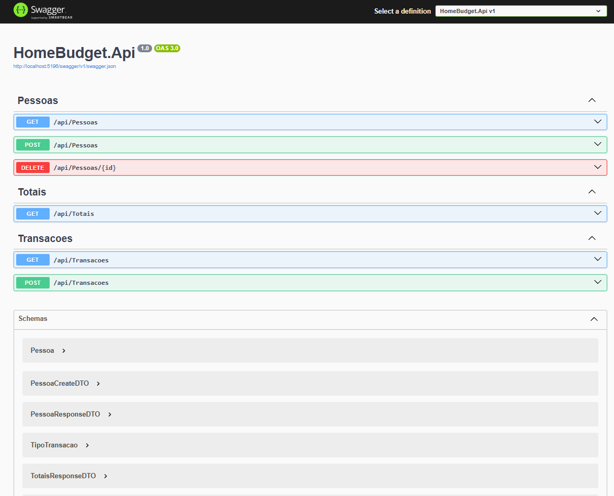

<div align="center">

# 🏠 Home Budget

### Sistema de Controle de Gastos Residenciais

Desenvolvido como teste técnico utilizando **ASP.NET Core (.NET 8)** no back-end e **React + TypeScript** no front-end.

---


</div>

---

# 📖 Sobre o projeto

O **Home Budget** é um sistema desenvolvido para realizar o controle de gastos residenciais, permitindo o gerenciamento de pessoas, receitas e despesas de forma simples e organizada.

O projeto foi desenvolvido seguindo os requisitos de um teste técnico, aplicando boas práticas de desenvolvimento, separação entre front-end e back-end, persistência de dados e regras de negócio.

---

# ✨ Funcionalidades

## 👤 Cadastro de Pessoas

- Cadastro de novas pessoas
- Listagem de pessoas
- Exclusão de pessoas
- Exclusão automática das transações relacionadas (Cascade Delete)

---

## 💰 Cadastro de Transações

- Cadastro de receitas
- Cadastro de despesas
- Associação da transação a uma pessoa
- Listagem das transações cadastradas

---

## 📊 Consulta de Totais

Exibe:

- Total de receitas por pessoa
- Total de despesas por pessoa
- Saldo individual
- Total geral do sistema

---

## 📈 Dashboard

O Dashboard apresenta um resumo geral contendo:

- Total de receitas
- Total de despesas
- Saldo geral
- Quantidade de pessoas cadastradas
- Últimas transações
- Gráfico comparativo entre receitas e despesas

---

# 📌 Regras de Negócio

O sistema implementa as seguintes regras:

✔ Apenas pessoas cadastradas podem possuir transações.

✔ Pessoas menores de 18 anos podem cadastrar apenas despesas.

✔ O valor da transação deve ser maior que zero.

✔ A descrição da transação é obrigatória.

✔ Ao excluir uma pessoa, todas as suas transações são removidas automaticamente.

✔ Os dados permanecem armazenados utilizando SQLite.

---

# 🛠 Tecnologias Utilizadas

## Back-end

- ASP.NET Core 8
- C#
- Entity Framework Core
- SQLite
- Swagger

---

## Front-end

- React
- TypeScript
- Vite
- Bootstrap
- Axios
- React Router DOM
- React Icons
- React Hot Toast
- SweetAlert2
- Chart.js

---

# 📂 Estrutura do Projeto

```
Codigo-fonte
│
├── backend
│   └── HomeBudget.Api
│       ├── Controllers
│       ├── Data
│       ├── DTOs
│       ├── Models
│       ├── Migrations
│       └── Program.cs
│
└── frontend
    ├── src
    │   ├── components
    │   ├── layouts
    │   ├── pages
    │   ├── services
    │   ├── styles
    │   └── App.tsx
```

---

# 🖼️ Telas

## Dashboard



```
images/dashboard.png
```

---

## Cadastro de Pessoas



```
images/pessoas.png
```

---

## Cadastro de Transações



```
images/transacoes.png
```

---

## Totais



```
images/totais.png
```

---

## Swagger



```
images/swagger.png
```

---

# 🚀 Como executar

## Clone o repositório

```bash
git clone https://github.com/LorranBezerra/Codigo-fonte.git
```

---

## Backend

```bash
cd backend/HomeBudget.Api
```

Instale as dependências

```bash
dotnet restore
```

Execute as migrations

```bash
dotnet ef database update
```

Inicie a API

```bash
dotnet run
```

A API estará disponível em:

```
http://localhost:5196
```

Swagger

```
http://localhost:5196/swagger
```

---

## Front-end

```bash
cd frontend
```

Instale as dependências

```bash
npm install
```

Execute

```bash
npm run dev
```

Aplicação disponível em

```
http://localhost:5173
```

---

# 💡 Melhorias Implementadas

Além dos requisitos solicitados no desafio, foram adicionadas melhorias para proporcionar uma melhor experiência ao usuário:

- Dashboard administrativo
- Pesquisa em tempo real
- Gráfico financeiro
- Toasts para notificações
- SweetAlert2 para confirmações e mensagens de erro
- Sidebar com ícones
- Layout responsivo
- Cards informativos
- Interface moderna baseada em Bootstrap

---

# 📚 Conceitos Aplicados

Durante o desenvolvimento foram utilizados conceitos como:

- Programação Orientada a Objetos (POO)
- REST API
- Entity Framework Core
- DTOs
- Relacionamentos entre entidades
- Cascade Delete
- Consumo de API com Axios
- Componentização no React
- Hooks (`useState`, `useEffect`)
- Organização em camadas
- Boas práticas de desenvolvimento

---

# 👨‍💻 Autor

### Lorran Rodrigues Bezerra

Estudante de Ciência da Computação - IFCE

Desenvolvedor Full Stack

📧 rodriguesbromen@gmail.com

🔗 GitHub

https://github.com/LorranBezerra

🔗 LinkedIn

https://www.linkedin.com/in/lorran-bezerra

---

<div align="center">

### ⭐ Obrigado por visitar este projeto!

Caso tenha alguma sugestão ou feedback, fique à vontade para entrar em contato.

</div>